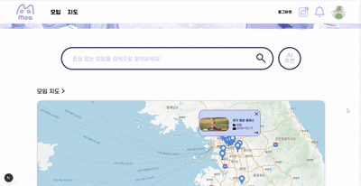
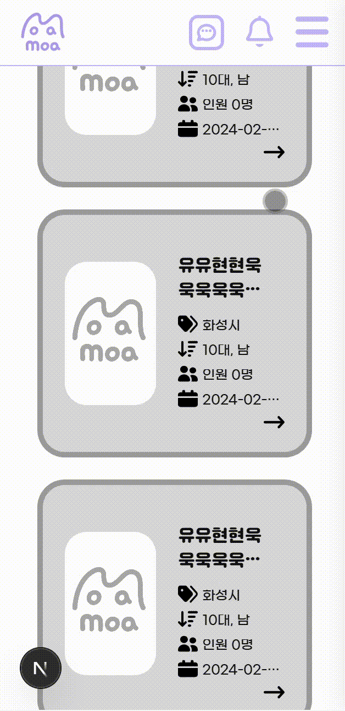
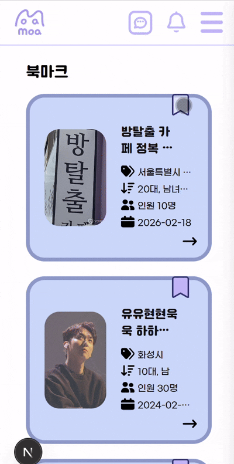
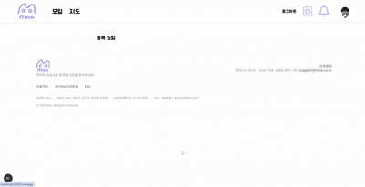
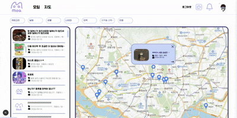
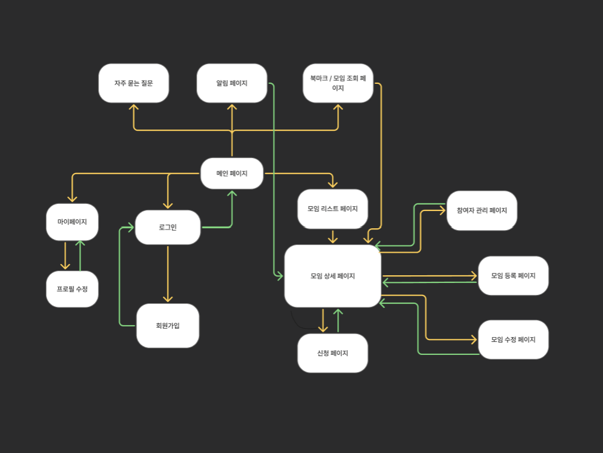

# 취미공유 앱 (Hobby Sharing App)

Next.js App Router 기반의 취미 공유 커뮤니티 플랫폼입니다.

## 📋 프로젝트 개요

사용자들이 자신의 취미를 공유하고 소통할 수 있는 게시판 형태의 웹 애플리케이션입니다.

## 👥 팀 멤버

| 프로필                                                    | 이름   | 역할       | 담당 페이지                                                                                                             | GitHub                                  |
| --------------------------------------------------------- | ------ | ---------- | ----------------------------------------------------------------------------------------------------------------------- | --------------------------------------- |
|  | 채민기 | 팀원, PM   | - 마이페이지, 수정페이지<br/> - 지도 페이지<br/> - 알림페이지<br/> - 필터 컴포넌트 페이지                               | [GitHub](https://github.com/minggichae) |
|      | 유현욱 | 팀원, PL   | - 헤더, 푸터 컴포넌트<br/> - 메인페이지, AI 추천<br/> - 참여자 관리, 모임신청<br/> - 채팅 페이지<br/> - 북마크 컴포넌트 | [GitHub](https://github.com/holyhw)     |
|    | 김현주 | 팀원, 서기 | - 모임리스트 페이지<br/> - 모임 상세 페이지                                                                             | [GitHub](https://github.com/kkhhjjoo)   |
|     | 김지안 | 팀원, 발표 | - 로그인, 회원가입페이지<br/> - 모임 등록 페이지<br/> - 모임 수정 페이지<br/> - 모임 조회 페이지                        | [GitHub](hhttps://github.com/jian526)   |

## 🛠 기술 스택

### Frontend

- **Framework**: React + Next.js (App Router)
- **Styling**: CSS
- **State Management**: Zustand (sessionStorage persist)
- **Data Fetching**: Fetch API + Next.js Server Actions

## ⚙️ 기술 스택

| 분류             | 툴                                                                                                                                                                                                                                                                                                                                                                                                        |
| ---------------- | --------------------------------------------------------------------------------------------------------------------------------------------------------------------------------------------------------------------------------------------------------------------------------------------------------------------------------------------------------------------------------------------------------- |
| **기술 스택**    |                                                                                    |
| **UI / UX**      |                                                                                                                                                                                                                                                                                                           |
| **개발 환경**    |                                                                                                                                                                                    |
| **커뮤니케이션** |     |
| **배포**         |                                                                                                                                                                                                                                                                                                        |

### 🖥️ 서비스 소개

#### 🔐 로그인/회원가입 페이지

- 이메일 로그인 가능
- 회원가입은 각각의 유효성 검사에 맞게 입력
- 주소 API 사용하여 주소 입력
<div align="center">
  
  
</div>
<div align="center">
  
  
</div>

#### 🏠 홈화면

- 메인 배너 및 서비스 안내, 모임 리스트 추천, 지도 미리보기: 카카오맵 연동
- 검색 기능: 키워드 및 카테고리 검색

<div align="center">
  
  
</div>

#### 모임리스트 페이지

- 카테고리별, 필터별 검색, 검색어 검색, 북마크 기능
<div align="center">
  
  
</div>

#### 모임목록

- 카테고리별 필터링, 검색

#### 모임상세

- 상세 정보 조회, 주최자 프로필

#### 모임등록/수정

- 이미지 업로드, 질문지 작성

#### 모임 신청

- 질문지 답변, 신청 관리

#### 모임조회

- 전체, 참여전, 참여후 보여줌
<div align="center">
  
  
</div>

#### 북마크

- 북마크 토글로 북마크 목록 추가 및 제거 가능
<div align="center">
  
  
</div>

#### 마이페이지

프로필 수정, 관리하기, 모임조회, 북마크 연결

<div align="center">
  
  
</div>

#### 관리페이지

- 참여 신청자 조회, 질문지 답변 확인, 승인/거절 처리, 알림 전송

<div align="center">
  
  
</div>

#### 모임지도

- 필터로 모임 필터링
- 지역별 모임 위치 표시 (카카오맵 API)

<div align="center">
  
  
</div>

#### ai추천

- AI 기반 모임 추천 결과

<div align="center">
  
  
</div>

#### 1:1채팅

### 🔄워크플로우



### 트러블슈팅

| 이름     | 문제점 | 해결 사례 |
| -------- | ------ | --------- |
| **민기** |        |           |
| **현욱** |        |           |
| **현주** |        |           |
| **지안** |        |           |

### Key Features

- 서버/클라이언트 컴포넌트 혼합 구성
- 캐시 태그 기반 데이터 갱신 (`revalidateTag`, `revalidatePath`)
- sessionStorage 기반 인증 상태 관리

## 📁 주요 기능

- **사용자 인증**: 로그인/회원가입
- **게시글**: 게시글 목록 조회, 상세 보기
- **게시글 관리**: 작성, 수정, 삭제
- **채팅 시스템**: 댓글 작성 및 관리
- **권한 관리**: 작성자 기반 수정/삭제 권한

개발 서버는 [http://localhost:3000](http://localhost:3000)에서 실행됩니다.

## 🏗 시스템 아키텍처

### 데이터 흐름

1. **조회**: 서버 컴포넌트에서 게시글/댓글 데이터 fetch
2. **생성/수정/삭제**: Server Action으로 API 호출
3. **캐시 갱신**: 성공 시 자동으로 캐시 업데이트
4. **인증**: 로그인 성공 시 Zustand store에 사용자 정보 저장

### API 통신

- 모든 요청에 `Client-Id` 헤더 포함
- 인증이 필요한 요청은 `Authorization: Bearer <token>` 헤더 사용
- 서버 측에서 권한 검증 수행

## 🔐 보안

- 인증 필요 기능은 로그인 사용자만 접근 가능
- 게시글/댓글 수정/삭제는 작성자 본인만 가능
- 토큰은 sessionStorage에 저장 (브라우저 종료 시 자동 삭제)

**개발 환경**: Node.js 18+ 권장

## 📌 스크럼/회의록

### 2026년 1월

| 일  |                     월                     |                     화                     |                     수                     |                     목                     |                     금                     | 토  |
| :-: | :----------------------------------------: | :----------------------------------------: | :----------------------------------------: | :----------------------------------------: | :----------------------------------------: | :-: |
|     |                                            |                                            |                                            |                     1                      |                     2                      |  3  |
|  4  |                     5                      |                     6                      |                     7                      |                     8                      |                     9                      | 10  |
| 11  |                     12                     |                     13                     | [14](docs/dailyscrum/0114-데일리스크럼.md) | [15](docs/dailyscrum/0115-데일리스크럼.md) | [16](docs/dailyscrum/0116-데일리스크럼.md) | 17  |
| 18  | [19](docs/dailyscrum/0119-데일리스크럼.md) | [20](docs/dailyscrum/0120-데일리스크럼.md) | [21](docs/dailyscrum/0121-데일리스크럼.md) | [22](docs/dailyscrum/0122-데일리스크럼.md) | [23](docs/dailyscrum/0123-데일리스크럼.md) | 24  |
| 25  | [26](docs/dailyscrum/0126-데일리스크럼.md) | [27](docs/dailyscrum/0127-데일리스크럼.md) | [28](docs/dailyscrum/0128-데일리스크럼.md) | [29](docs/dailyscrum/0129-데일리스크럼.md) | [30](docs/dailyscrum/0130-데일리스크럼.md) | 31  |

### 2026년 2월

| 일  |                    월                     |                     화                     |                    수                     |                    목                     |                    금                     | 토  |
| :-: | :---------------------------------------: | :----------------------------------------: | :---------------------------------------: | :---------------------------------------: | :---------------------------------------: | :-: |
|  1  | [2](docs/dailyscrum/0202-데일리스크럼.md) | [3](docs/dailyscrum/0203-데일리스크럼.md)  | [4](docs/dailyscrum/0204-데일리스크럼.md) | [5](docs/dailyscrum/0205-데일리스크럼.md) | [6](docs/dailyscrum/0206-데일리스크럼.md) |  7  |
|  8  | [9](docs/dailyscrum/0209-데일리스크럼.md) | [10](docs/dailyscrum/0210-데일리스크럼.md) |                    11                     |                    12                     |                    13                     | 14  |
| 15  |                    16                     |                     17                     |                    18                     |                    19                     |                    20                     | 21  |
| 22  |                    23                     |                     24                     |                    25                     |                    26                     |                    27                     | 28  |

### 프로젝트 폴더 구조

```
src
├─ app
│  ├─ (auth)
│  │  ├─ login
│  │  │  └─ page.tsx
│  │  └─ signup
│  │     └─ page.tsx
│  │
│  ├─ (main)
│  │  ├─ page.tsx
│  │  └─ components
│  │     ├─ Hamburger.tsx
│  │     └─ AiRecommendModal.tsx
│  │
│  ├─ (view)
│  │  ├─ Bookmarks
│  │  │  └─ page.tsx
│  │  └─ History
│  │     └─ page.tsx
│  │
│  ├─ components
│  │  ├─ Filter.tsx
│  │  ├─ Footer.tsx
│  │  ├─ Header.tsx
|  |  ├─ Author.tsx
|  |  ├─ BookmarkButton.tsx
|  |  ├─ DefaultLayout.tsx
|  |  ├─ MeetingCard.tsx
|  |  └─ MobileSidebar.tsx
│  │
│  ├─ meetings
│  │  ├─ [id]
│  │  │  ├─ apply
│  │  │  │  └─ page.tsx
│  │  │  ├─ edit
│  │  │  │  └─ page.tsx
│  │  │  └─ page.tsx
│  │  ├─ add
│  │  │  └─ page.tsx
│  │  └─ page.tsx
│  │
│  ├─ map
│  │  └─ page.tsx
│  │
│  ├─ mypage
│  │  ├─ modify
│  │  │  └─ page.tsx
│  │  └─ page.tsx
│  │
│  ├─ notifications
│  │  └─ page.tsx
│  │
│  ├─ faq
│  │  └─ page.tsx
│  │
│  ├─ manage
│  │  └─ page.tsx
│  │
│  ├─ layout.tsx
│  ├─ loading.tsx
│  ├─ error.tsx
│  ├─ not-found.tsx
│  └─ globals.css
│
├─ lib
│  ├─ api
│  │  ├─ auth.ts
│  │  ├─ meeting.ts
│  │  ├─ bookmarks.ts
│  │  ├─ notification.ts
|  |  ├─ chat.ts
|  |  └─ user.ts
│  │
│  ├─ hooks
│  │  ├─ useAuth.ts
│  │  ├─ useMeeting.ts
│  │  └─ useBookmark.ts
│  │
│  └─ utils
│     ├─ validators.ts
│     └─ format.ts
│
├─ store
│  ├─ authStore.ts
│  ├─ userStore.ts
│  └─ meetingStore.ts
│
├─ types
│  ├─ auth.ts
│  ├─ meeting.ts
│  ├─ user.ts
│  ├─ notification.ts
|  ├─ api.ts
|  ├─ chat.ts
|  ├─ kakaomap.ts
|  └─ manage.ts
│
├─ styles
│  └─ globals.css
│
├─ utils
| └─ apiWithAuth.ts
|
├─ zustand
|  ├─ bookmarkStore.ts
|  ├─ chatStore.ts
|  ├─ meetingStore.ts
|  ├─ notificationStore.ts
|  └─ userStore.ts
└─
```

## 📂 주요 디렉토리 설명

### 🔐 `/app/(auth)`

**인증 관련 페이지**

- `login/page.tsx` - 로그인 페이지
- `signup/page.tsx` - 회원가입 페이지

### 🏠 `/app/(main)`

**메인 페이지**

- `page.tsx` - 메인 페이지
- `components/` - 메인 페이지 전용 컴포넌트
  - `Hamburger.tsx` - 햄버거 메뉴
  - `AiRecommendModal.tsx` - AI 추천 모달

### 👁️ `/app/(view)`

**뷰 페이지**

- `Bookmarks/page.tsx` - 북마크 목록 페이지
- `History/page.tsx` - 히스토리 페이지

### 🧩 `/app/components`

**공통 컴포넌트**

- `Filter.tsx` - 필터 컴포넌트
- `Footer.tsx` - 푸터 컴포넌트
- `Header.tsx` - 헤더 컴포넌트

### 👥 `/app/meetings`

**모임 관련 페이지**

- `page.tsx` - 모임 목록 페이지
- `add/page.tsx` - 모임 등록 페이지
- `[id]/page.tsx` - 모임 상세 페이지
- `[id]/apply/page.tsx` - 모임 신청 페이지
- `[id]/edit/page.tsx` - 모임 수정 페이지

### 🗺️ `/app/map`

**지도 페이지**

- `page.tsx` - 모임 지도 페이지

### 👤 `/app/mypage`

**마이페이지**

- `page.tsx` - 마이페이지
- `modify/page.tsx` - 프로필 수정 페이지

### 🔔 `/app/notifications`

**알림 페이지**

- `page.tsx` - 알림 목록 페이지

### ❓ `/app/faq`

**FAQ 페이지**

- `page.tsx` - 자주 묻는 질문 페이지

### 📋 `/app/manage`

**관리 페이지**

- `page.tsx` - 모임 관리 페이지

### 🔧 `/lib`

**라이브러리 및 유틸리티**

#### `/lib/api`

API 호출 함수

- `auth.ts` - 인증 관련 API
- `meeting.ts` - 모임 관련 API
- `bookmark.ts` - 북마크 관련 API
- `notification.ts` - 알림 관련 API
- `ai.ts` - AI 추천 관련 API

#### `/lib/hooks`

커스텀 React Hooks

- `useAuth.ts` - 인증 관련 Hook
- `useMeeting.ts` - 모임 관련 Hook
- `useBookmark.ts` - 북마크 관련 Hook

#### `/lib/utils`

유틸리티 함수

- `validators.ts` - 유효성 검사 함수
- `format.ts` - 포맷팅 함수

### 💾 `/store`

**상태 관리 (Zustand)**

- `authStore.ts` - 인증 상태 관리
- `userStore.ts` - 사용자 정보 상태 관리
- `meetingStore.ts` - 모임 정보 상태 관리

### 📝 `/types`

**TypeScript 타입 정의**

- `auth.ts` - 인증 관련 타입
- `meeting.ts` - 모임 관련 타입
- `user.ts` - 사용자 관련 타입
- `notification.ts` - 알림 관련 타입

### 🎨 `/styles`

**전역 스타일**

- `globals.css` - 전역 CSS
