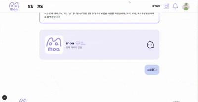
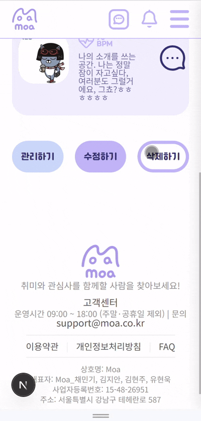
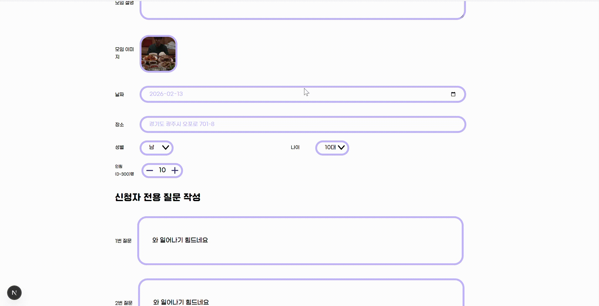
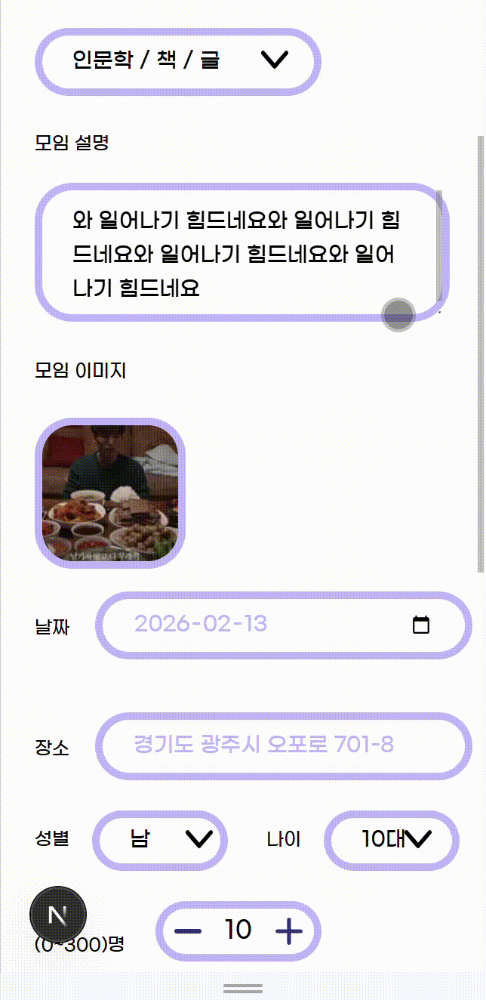
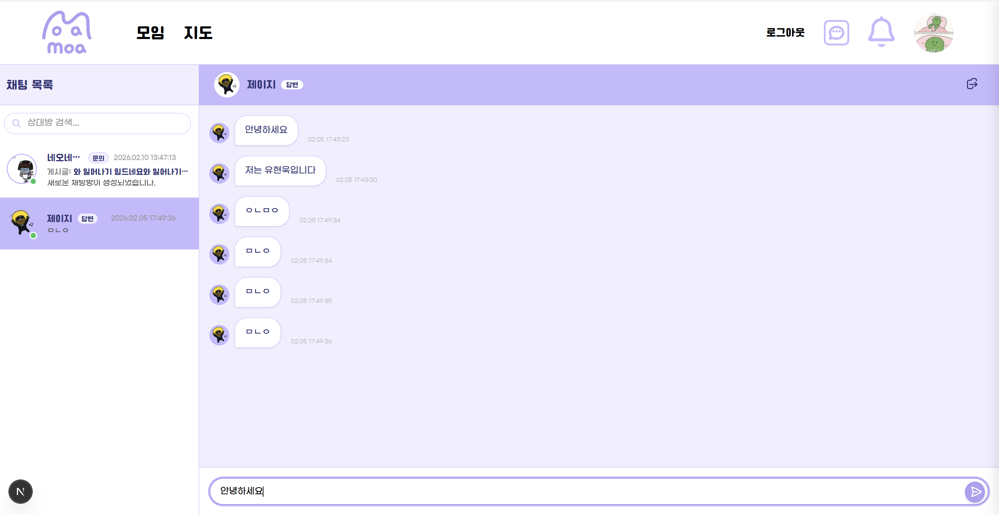
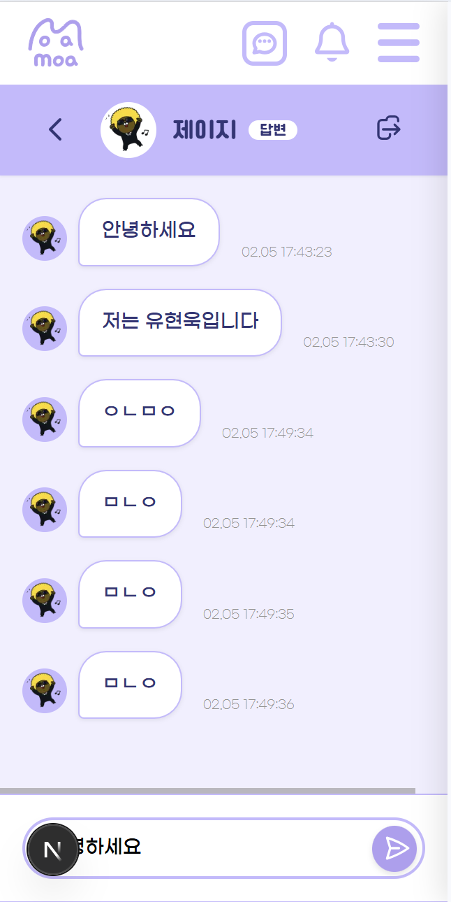

# Moa (모아) - 취미 공유 플랫폼

Next.js App Router 기반의 취미 공유 커뮤니티 플랫폼입니다.

## 📋 프로젝트 개요

사용자들이 자신의 취미를 공유하고 소통할 수 있는 모임 플랫폼입니다.

## 🌐 배포 주소

- 배포 URL: https://final-07-moa-release.vercel.app/

## 📅 개발 기간

- **기획**: 2026.01.14(수) ~ 2026.01.21(수)
- **개발**: 2026.01.22(목) ~ 2026.02.09(일)
- **점검**: 2026.02.10(화) ~ 2026.02.12(목)
- **수료**: 2026.02.13(금)

## 👥 팀 멤버

| 프로필                                                    | 이름   | 역할       | 담당 페이지                                                                                                             | GitHub                                  |
| --------------------------------------------------------- | ------ | ---------- | ----------------------------------------------------------------------------------------------------------------------- | --------------------------------------- |
|  | 채민기 | 팀원, PM   | - 마이페이지, 수정페이지<br/> - 지도 페이지<br/> - 알림페이지<br/> - 필터 컴포넌트                                      | [GitHub](https://github.com/minggichae) |
|      | 유현욱 | 팀원, PL   | - 헤더, 푸터 컴포넌트<br/> - 메인페이지, AI 추천<br/> - 참여자 관리, 모임신청<br/> - 채팅 페이지<br/> - 북마크 컴포넌트 | [GitHub](https://github.com/holyhw)     |
|    | 김현주 | 팀원, 서기 | - 모임리스트 페이지<br/> - 모임 상세 페이지                                                                             | [GitHub](https://github.com/kkhhjjoo)   |
|     | 김지안 | 팀원, 발표 | - 로그인, 회원가입 페이지<br/> - 모임 등록 페이지<br/> - 모임 수정 페이지<br/> - 모임 조회 페이지                       | [GitHub](https://github.com/jian526)    |

## ⚙️ 기술 스택

| 분류             | 기술                                                                                                                                                                                                                                                                                                                                                                                                      |
| ---------------- | --------------------------------------------------------------------------------------------------------------------------------------------------------------------------------------------------------------------------------------------------------------------------------------------------------------------------------------------------------------------------------------------------------- |
| **프론트엔드**   |                                                                                    |
| **상태 관리**    |                                                                                                                                                                                                                                  |
| **백엔드/DB**    |                                                                                                                                                                                                                                                                                                     |
| **API**          |                                                                                                                                                                                            |
| **UI/UX**        |                                                                                                                                                                                                                                                                                                           |
| **개발 환경**    |                                                                                                                                                                                                                                                                                 |
| **커뮤니케이션** |     |
| **배포**         |                                                                                                                                                                                                                                                                                                        |

## 🛠 개발 환경

| 구분     | 종류                                       |
| -------- | ------------------------------------------ |
| FrontEnd | React, Next.js, Axios, CSS Module, Zustand |
| BackEnd  | MongoDB, Kakao Map API, OpenAI API         |

## 📚 라이브러리 사용 이유

| 종류       | 이유                                                             |
| ---------- | ---------------------------------------------------------------- |
| React      | 재사용 가능한 컴포넌트 사용하기 위해 사용                        |
| Next.js    | 서버 사이드 렌더링과 라우팅을 효율적으로 관리하기 위해 사용      |
| Zustand    | 단순한 상태 관리와 용이한 유지 보수를 위해 사용                  |
| Axios      | HTTP 통신 로직을 쉽게 관리하기 위해 사용                         |
| CSS Module | 스타일 관리의 독립성을 높이고 유지 보수성을 향상시키기 위해 사용 |

## 🖥️ 주요 기능

### 🔐 로그인/회원가입

- 이메일 로그인 가능
- 회원가입 시 각 항목별 유효성 검사
- 주소 API를 통한 주소 입력

| 데스크톱                                       | 모바일                                                    |
| ---------------------------------------------- | --------------------------------------------------------- |
|  |  |
|    |    |

---

### 🏠 홈화면

- 메인 배너 및 서비스 안내
- 모임 리스트 추천
- 지도 미리보기: 카카오맵 연동
- 검색 기능: 키워드 및 카테고리 검색

| 데스크톱                                     | 모바일                                                  |
| -------------------------------------------- | ------------------------------------------------------- |
|  |  |

---

### 📋 모임목록

- 카테고리별, 필터별 검색
- 검색어 검색
- 북마크 기능

| 데스크톱                                          | 모바일                                                      |
| ------------------------------------------------- | ----------------------------------------------------------- |
|   |  |
|  |                                                             |

---

### 📄 모임상세

- 상세 정보 조회
- 주최자 프로필 확인

| 데스크톱                                         | 모바일                                                      |
| ------------------------------------------------ | ----------------------------------------------------------- |
|  |  |

---

### ➕ 모임등록

- 모임 제목, 카테고리, 설명, 날짜, 장소, 성별, 나이, 인원 설정
- 모임 이미지 업로드
- 질문지 작성

| 데스크톱                                       | 모바일                                                    |
| ---------------------------------------------- | --------------------------------------------------------- |
|  |  |

---

### ✏️ 모임수정

- 기존 모임 내용 호출
- 이미지 업로드 수정
- 질문지 작성 수정

| 데스크톱                                       | 모바일                                                    |
| ---------------------------------------------- | --------------------------------------------------------- |
|  |  |

---

### ✉️ 모임신청

- 질문지 답변
- 신청 관리

| 데스크톱                                       | 모바일                                                    |
| ---------------------------------------------- | --------------------------------------------------------- |
|  |  |

---

### 👀 모임조회

- 전체, 참여 전, 참여 후 구분 표시

| 데스크톱                                       | 모바일                                                    |
| ---------------------------------------------- | --------------------------------------------------------- |
|  |  |

---

### ⭐ 북마크

- 북마크 토글로 목록 추가/제거 가능

| 데스크톱                                     | 모바일                                                  |
| -------------------------------------------- | ------------------------------------------------------- |
|  |  |

---

### 👤 마이페이지

- 프로필 수정
- 관리하기
- 모임조회
- 북마크 연결

| 데스크톱                                         | 모바일                                                      |
| ------------------------------------------------ | ----------------------------------------------------------- |
|  |  |

---

### ⚙️ 관리페이지

- 참여 신청자 조회
- 질문지 답변 확인
- 승인/거절 처리
- 알림 전송

| 데스크톱                                         | 모바일                                                      |
| ------------------------------------------------ | ----------------------------------------------------------- |
|  |  |

---

### 🗺️ 모임지도

- 필터로 모임 필터링
- 지역별 모임 위치 표시 (카카오맵 API)

| 데스크톱                                         | 모바일                                                      |
| ------------------------------------------------ | ----------------------------------------------------------- |
|  |  |

---

### 🤖 AI 추천

- AI 기반 모임 추천 결과 제공

| 데스크톱                                 | 모바일                                              |
| ---------------------------------------- | --------------------------------------------------- |
|  |  |

---

### 💬 1:1 채팅

- 주최자와 실시간 채팅

| 데스크톱                                   | 모바일                                                |
| ------------------------------------------ | ----------------------------------------------------- |
|  |  |

---

## 🔄 워크플로우

<div align="center">
  
</div>

## 🐛 트러블슈팅

| 이름     | 문제점                                                                                                                                                                                                                                                                                                                                                                                                                                                                                                     | 해결 방법                                                                                                                                                                                                                                                                                                                                                                                                                                                                                                                                                                            |
| -------- | ---------------------------------------------------------------------------------------------------------------------------------------------------------------------------------------------------------------------------------------------------------------------------------------------------------------------------------------------------------------------------------------------------------------------------------------------------------------------------------------------------------- | ------------------------------------------------------------------------------------------------------------------------------------------------------------------------------------------------------------------------------------------------------------------------------------------------------------------------------------------------------------------------------------------------------------------------------------------------------------------------------------------------------------------------------------------------------------------------------------ |
| **민기** | -                                                                                                                                                                                                                                                                                                                                                                                                                                                                                                          | -                                                                                                                                                                                                                                                                                                                                                                                                                                                                                                                                                                                    |
| **현욱** | -                                                                                                                                                                                                                                                                                                                                                                                                                                                                                                          | -                                                                                                                                                                                                                                                                                                                                                                                                                                                                                                                                                                                    |
| **현주** | 북마크 클릭 시 여러 개가 동시에 선택되는 버그 발생. `git pull`을 받지 않아 최신 코드가 누락됨.                                                                                                                                                                                                                                                                                                                                                                                                             | `git pull`, `git merge`를 통해 최신 코드 동기화 후 해결                                                                                                                                                                                                                                                                                                                                                                                                                                                                                                                              |
| **지안** | 1. **Git 브랜치 동기화 문제**: `develop` 브랜치에서 `git pull`이 정상적으로 되지 않는 문제 발생<br/>2. **CSS Module `:global` 사용 문제**: CSS Module에서 `:global`을 사용하면서 스타일이 전역으로 적용되어 다른 페이지에도 영향을 주는 문제 발생<br/>3. **로그인 상태 유지 문제**: 로그인 여부를 `useState`로만 판단해 로그인되지 않았을 경우 로그인 페이지로 강제 이동하도록 구현했는데, 새로고침 시 로그인 상태에서도 로그인 화면으로 이동하는 문제 발생. Hydration 이전 상태를 `false`로 인식했기 때문 | 1. **Git 동기화 해결**: rebase 사용 시 발생하는 히스토리 오염 문제를 팀원들에게 공유. 이후 `git pull`이 되지 않는 경우 `rebase` 대신 `merge` 전략을 사용하도록 협업 방식을 정리하여 develop 브랜치와의 버전을 안정적으로 맞춤<br/>2. **CSS 격리**: `:global` 사용을 최소화하고, 필요한 경우 더 구체적인 선택자를 사용하여 적용 범위를 제한. 컴포넌트 단위로 스타일이 격리되도록 구조 개선<br/>3. **Hydration 처리**: `useStore.ts`에 `setHasHydrated`를 추가하여 상태가 hydration된 이후에만 로그인 여부를 판단하도록 수정. 새로고침 시에도 로그인 상태가 정상적으로 유지되도록 개선 |

## 🏗 시스템 아키텍처

### 기술 구성

- **Frontend**: React + Next.js (App Router)
- **Styling**: CSS Module
- **상태 관리**: Zustand (sessionStorage persist)
- **서버 통신**: Fetch API + Next.js Server Actions
- **캐시/갱신**: fetch 캐시 태그 + revalidateTag, revalidatePath

### 데이터 흐름

1. **조회**: 서버 컴포넌트에서 게시글/댓글 데이터 fetch
2. **생성/수정/삭제**: Server Action으로 API 호출
3. **캐시 갱신**: 성공 시 자동으로 캐시 업데이트
4. **인증**: 로그인 성공 시 Zustand store에 사용자 정보 저장

### API 통신

- 모든 요청에 `Client-Id` 헤더 포함
- 인증이 필요한 요청은 `Authorization: Bearer <token>` 헤더 사용
- 서버 측에서 권한 검증 수행

## 🔐 보안 및 정책

- 인증 필요 기능은 로그인 사용자만 접근 가능
- 수정/삭제는 작성자 본인만 가능
- 토큰은 sessionStorage에 저장

## 📌 스크럼/회의록

### 2026년 1월

| 일  |                     월                     |                     화                     |                     수                     |                     목                     |                     금                     | 토  |
| :-: | :----------------------------------------: | :----------------------------------------: | :----------------------------------------: | :----------------------------------------: | :----------------------------------------: | :-: |
|     |                                            |                                            |                                            |                     1                      |                     2                      |  3  |
|  4  |                     5                      |                     6                      |                     7                      |                     8                      |                     9                      | 10  |
| 11  |                     12                     |                     13                     | [14](docs/dailyscrum/0114-데일리스크럼.md) | [15](docs/dailyscrum/0115-데일리스크럼.md) | [16](docs/dailyscrum/0116-데일리스크럼.md) | 17  |
| 18  | [19](docs/dailyscrum/0119-데일리스크럼.md) | [20](docs/dailyscrum/0120-데일리스크럼.md) | [21](docs/dailyscrum/0121-데일리스크럼.md) | [22](docs/dailyscrum/0122-데일리스크럼.md) | [23](docs/dailyscrum/0123-데일리스크럼.md) | 24  |
| 25  | [26](docs/dailyscrum/0126-데일리스크럼.md) | [27](docs/dailyscrum/0127-데일리스크럼.md) | [28](docs/dailyscrum/0128-데일리스크럼.md) | [29](docs/dailyscrum/0129-데일리스크럼.md) | [30](docs/dailyscrum/0130-데일리스크럼.md) | 31  |

### 2026년 2월

| 일  |                    월                     |                     화                     |                     수                     |                     목                     | 금  | 토  |
| :-: | :---------------------------------------: | :----------------------------------------: | :----------------------------------------: | :----------------------------------------: | :-: | :-: |
|  1  | [2](docs/dailyscrum/0202-데일리스크럼.md) | [3](docs/dailyscrum/0203-데일리스크럼.md)  | [4](docs/dailyscrum/0204-데일리스크럼.md)  | [5](docs/dailyscrum/0205-데일리스크럼.md)  |  6  |  7  |
|  8  | [9](docs/dailyscrum/0209-데일리스크럼.md) | [10](docs/dailyscrum/0210-데일리스크럼.md) | [11](docs/dailyscrum/0211-데일리스크럼.md) | [12](docs/dailyscrum/0212-데일리스크럼.md) | 13  | 14  |
| 15  |                    16                     |                     17                     |                     18                     |                     19                     | 20  | 21  |
| 22  |                    23                     |                     24                     |                     25                     |                     26                     | 27  | 28  |

## 📁 프로젝트 폴더 구조

```
src/
├── app/
│   ├── (auth)/
│   │   ├── login/
│   │   │   └── page.tsx
│   │   └── signup/
│   │       └── page.tsx
│   │
│   ├── (main)/
│   │   ├── page.tsx
│   │   └── components/
│   │       ├── Hamburger.tsx
│   │       └── AiRecommendModal.tsx
│   │
│   ├── (view)/
│   │   ├── Bookmarks/
│   │   │   └── page.tsx
│   │   └── History/
│   │       └── page.tsx
│   │
│   ├── components/
│   │   ├── Filter.tsx
│   │   ├── Footer.tsx
│   │   ├── Header.tsx
│   │   ├── Author.tsx
│   │   ├── BookmarkButton.tsx
│   │   ├── DefaultLayout.tsx
│   │   ├── MeetingCard.tsx
│   │   └── MobileSidebar.tsx
│   │
│   ├── meetings/
│   │   ├── [id]/
│   │   │   ├── apply/
│   │   │   │   └── page.tsx
│   │   │   ├── edit/
│   │   │   │   └── page.tsx
│   │   │   └── page.tsx
│   │   ├── add/
│   │   │   └── page.tsx
│   │   └── page.tsx
│   │
│   ├── map/
│   │   └── page.tsx
│   │
│   ├── mypage/
│   │   ├── modify/
│   │   │   └── page.tsx
│   │   └── page.tsx
│   │
│   ├── notifications/
│   │   └── page.tsx
│   │
│   ├── faq/
│   │   └── page.tsx
│   │
│   ├── manage/
│   │   └── page.tsx
│   │
│   ├── layout.tsx
│   ├── loading.tsx
│   ├── error.tsx
│   ├── not-found.tsx
│   └── globals.css
│
├── lib/
│   ├── api/
│   │   ├── auth.ts
│   │   ├── meeting.ts
│   │   ├── bookmarks.ts
│   │   ├── notification.ts
│   │   ├── chat.ts
│   │   └── user.ts
│   │
│   ├── hooks/
│   │   ├── useAuth.ts
│   │   ├── useMeeting.ts
│   │   └── useBookmark.ts
│   │
│   └── utils/
│       ├── validators.ts
│       └── format.ts
│
├── store/
│   ├── authStore.ts
│   ├── userStore.ts
│   └── meetingStore.ts
│
├── types/
│   ├── auth.ts
│   ├── meeting.ts
│   ├── user.ts
│   ├── notification.ts
│   ├── api.ts
│   ├── chat.ts
│   ├── kakaomap.ts
│   └── manage.ts
│
├── styles/
│   └── globals.css
│
├── utils/
│   └── apiWithAuth.ts
│
└── zustand/
    ├── bookmarkStore.ts
    ├── chatStore.ts
    ├── meetingStore.ts
    ├── notificationStore.ts
    └── userStore.ts
```

---

## 💻 개발 환경

**권장 환경**: Node.js 18+
